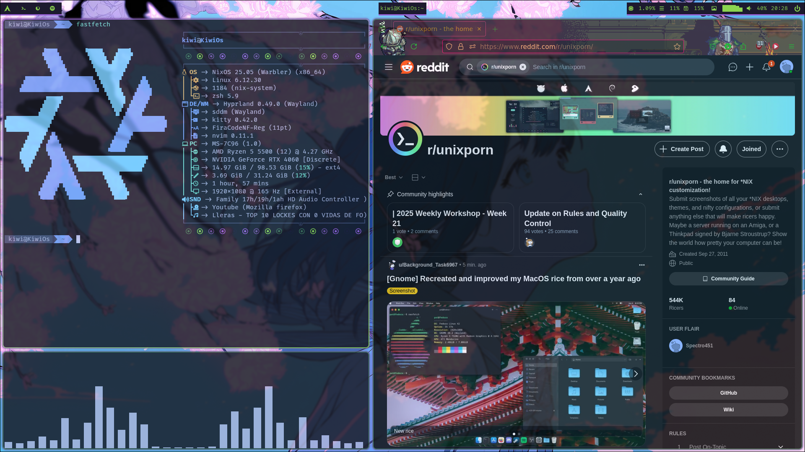
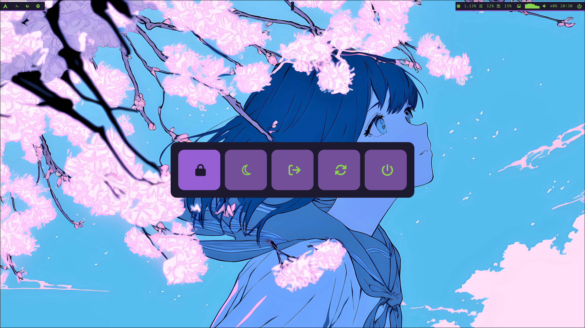

# Mis Dotfiles para NixOs

Este repositorio contiene mis configuraciones personalizadas para NixOS, incluyendo archivos de configuración del sistema, scripts personales y wallpapers.

## Secciones

<details>
<summary><strong>Español</strong></summary>

- [Lista de objetivos](#lista-de-objetivos)
- [Objetivo](#objetivo)
- [Instalación](#instalación)


  
## Lista de objetivos

- [x] Configurar `configuration.nix` completamente
- [x] Personalizar mi sistema a gusto
- [x] Añadir vscode
- [x] Configurar waybar
- [x] Darle un layout de inicio a mi hyprland
- [ ] Declarar las extensiones que quiero para VsCode
- [x] Permitir cambiar de fondo desde waybar y automatico
- [x] Tener un PowerMenu en waybar
- [ ] Poder cambiar el tema en base al fondo
- [x] Crear un Script de instalacion
- [x] Aprender a manejar el sistema por home-manager
- [ ] Modularizar mi sistema
- [ ] Agregar binds utiles en el sistema
- [ ] Aprender a usar nvim sin de comandos con ":"
- [ ] Bloqueo de pantalla automatico
- [ ] Suspension del equipo automatica
- [ ] Agregar y personalizar Spotify
- [ ] Hacer la instalacion automatica
- [ ] ...

## Objetivo

Mi objetivo principal es poder tener un sistema totalmente reproducible, por lo cual quiero aprender a hacer flakes siguiendo una metodologia de empezar por un `configuration.nix` simple, a un home-manager y por ultimo tener un sistema modular y organizado en flake
para el final de esto espero poder manejarme completamente en nix y poder usarlo como mi sistema para trabajar

## Instalación

```bash
# Clona el repositorio en tu HOME o donde prefieras
git clone https://github.com/tu-usuario/.NixOs-Dots.git ~/.NixOs-Dots

# Debes modificar 3 archivos para que se adapten a tu nombre de host y usuario:

# En configuration.nix
networking.hostName = "TuHost";
users.users.tu_usuario

# En home.nix
home.username = "tu_usuario";
home.homeDirectory = "/home/tu_usuario";

# En flake.nix
nixosConfigurations = {
  TuHost = lib.nixosSystem {
homeConfigurations = {
  tu_usuario = home-manager.lib.homeManagerConfiguration {

# Cambia al directorio de los dots
cd ./NixOs-Dots/

# Ejecuta el comando para la nueva gen
sudo nixos-rebuild switch --flake ~/.NixOs-Dots#TuHost

# Ejecuta el comando para las variables del usuario
home-manager switch --flake ~/.NixOs-Dots#tu_usuario

```
</details>
<details>
<summary><strong>English</strong></summary>

- [Checklist](#Checklist)
- [Main objective](#main-objective)
- [Installation](#installation)


## Checklist

- [x] Fully configure `configuration.nix`
- [x] Customize system to my liking
- [x] Add VSCode
- [x] Configure waybar
- [x] Set up an initial layout for Hyprland
- [ ] Declare the VSCode nsions I want
- [x] Allow wallpaper changes from waybar and automatically
- [x] Have a PowerMenu in waybar
- [ ] Change theme based on the wallpaper
- [x] Create an installation script
- [ ] Learn to manage the system with home-manager
- [ ] Modularize my system
- [ ] Add useful keybinds to the system
- [ ] Learn to use nvim without needing ":" commands
- [ ] Automatic screen lock
- [ ] Automatic system suspend
- [ ] Install Spotify and tune it
- [ ] Make a install script
- [ ] ...

## Main objective

My main goal is to have a fully reproducible system.  
I want to learn how to use flakes by starting with a simple `configuration.nix`, then moving on to home-manager, and finally building a modular and well-organized flake-based setup.  
By the end of this process, I aim to be fully proficient with Nix and use it as my daily working system.

## Installation

```bash
# Clone the repository into your HOME or any preferred location
git clone https://github.com/your-username/.NixOs-Dots.git ~/.NixOs-Dots

# You must edit 3 files to match your hostname and username:

# In configuration.nix
networking.hostName = "YourHost";
users.users.your_username

# In home.nix
home.username = "your_username";
home.homeDirectory = "/home/your_username";

# In flake.nix
nixosConfigurations = {
  YourHost = lib.nixosSystem {
homeConfigurations = {
  your_username = home-manager.lib.homeManagerConfiguration {

# Change to the dotfiles directory
cd ./NixOs-Dots/

# Run the system rebuild command
sudo nixos-rebuild switch --flake ~/.NixOs-Dots#YourHost

# Run the user configuration command
home-manager switch --flake ~/.NixOs-Dots#your_username
```
</details>

## Imagenes

- _Pantalla principal._
  

- _Menú flotante para suspender, apagar o reiniciar el sistema._
  

- _Wallpaper._
  
